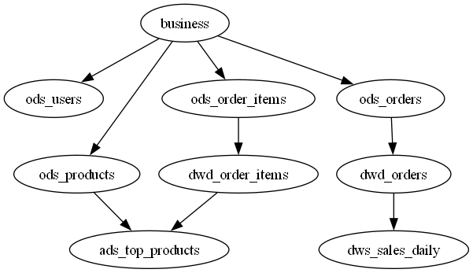

# 离线数仓与数据血缘分析

## 项目简介
本项目模拟电商业务场景，基于 MySQL 构建业务数据库（用户、商品、订单、订单明细），并搭建离线数据仓库。通过 Python 实现 ETL 过程，完成数据从业务库到数仓的分层加工（ODS → DWD → DWS → ADS），最终生成日销售汇总表和 Top 10 商品榜单。同时，利用 Graphviz 生成数据血缘图，清晰展示表与表之间的依赖关系。

## 项目结构

warehouse_project/

├── generate_business_data_mysql.py   # 生成业务数据

├── warehouse.sql                     # 对warehouse 数据库分层建表

├── etl_mysql.py                      # ETL 主脚本

├── lineage.py                        # 数据血缘分析脚本

├── requirements.txt                  # Python 依赖

├── lineage.png                       # 生成的血缘图

└── README.md                         # 项目说明

## 技术栈
- **数据库**：MySQL 8.0
- **数据处理**：Python（pandas、sqlalchemy、pymysql）
- **数据可视化**：Graphviz（血缘图）
- **其他**：faker（模拟数据生成）

## 数仓分层设计
| 分层 | 表名 | 说明 |
|------|------|------|
| ODS 层 | ods_users, ods_products, ods_orders, ods_order_items | 与业务库结构一致，原样存储 |
| DWD 层 | dwd_orders, dwd_order_items | 明细数据，对订单表增加 `order_date` 字段（从 `order_time` 派生） |
| DWS 层 | dws_sales_daily | 按日聚合：订单数、销售额、活跃用户数 |
| ADS 层 | ads_top_products | 应用数据：销量 Top 10 商品及排名 |

## ETL 流程
使用 Python 脚本完成以下步骤：

1. **数据抽取**：从业务库 `business` 读取用户、商品、订单、订单明细表。
2. **数据转换**：
   - 将 `ods_orders` 中的 `order_time` 转换为日期类型，生成 `order_date` 列，存入 `dwd_orders`。
   - （可根据需要扩展清洗逻辑：过滤未支付订单、去除空值等）
3. **数据加载**：
   - 将清洗后的数据写入 `dwd_orders` 和 `dwd_order_items`。
   - 按日聚合生成 `dws_sales_daily`。
   - 统计销量 Top 10 商品，生成 `ads_top_products`。

ETL 脚本 `etl_mysql.py` 使用 `pandas` 进行数据处理，通过 `sqlalchemy` 连接 MySQL。

## 数据血缘分析
通过解析 ETL 中使用的 SQL 语句，提取表依赖关系，利用 Graphviz 生成血缘图，直观展示数据从业务库到数仓各层的流动路径。

**血缘图示例**（实际运行生成）：

### 环境要求
- Python 3.8+
- MySQL 8.0
- Graphviz 软件（用于生成血缘图）

